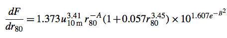
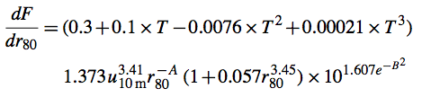

.. _aerguide:

#############
Aerosol types
#############

.. _aerguide-carbon:

=====================
Carbonaceous aerosols
=====================

**Reference**: :cite:t:`Park_et_al._2003`.  This paper describes the
original formulation of carbonaceous aerosols in GEOS-Chem:

   The simulation of carbonaceous aerosols in GEOS-Chem follows that of
   the Georgia Tech/Goddard Global Ozone Chemistry Aerosol Radiation and
   Transport (GOCART) model :cite:t:`Chin_et_al._2002`, with a number of
   modifications described below. The model resolves EC and OC, with a
   hydrophobic and a hydrophilic fraction for each (i.e., four aerosol
   types). Combustion sources emit hydrophobic aerosols that then become
   hydrophilic with an e-folding time of 1.2 days following
   :cite:t:`Cooke_et_al._1999`  and :cite:t:`Chin_et_al._2002`. We
   assume that 80% of EC and 50% of OC emitted from all primary
   sources are hydrophobic [:cite:t:`Cooke_et_al._1999`;
   :cite:t:`Chin_et_al._2002`, :cite:t:`Chung_and_Seinfeld_2002`. All
   secondary OC is assumed to be hydrophilic. The four aerosol types in
   the model are further resolved into contributions from fossil fuel,
   biofuel, and biomass burning, plus an OC component of biogenic
   origin, resulting in a total of 13 tracers transported by the model.

   Simulation of aerosol wet and dry deposition follows the schemes used
   by :cite:t:`Liu_et_al._2001` in previous GEOS-Chem simulations of
   :math:`^{210}Pb` and :math:`^{7}Be` aerosol tracers. Wet deposition
   includes contributions from scavenging in convective updrafts,
   rainout from convective anvils, and rainout and washout from
   large-scale precipitation. Wet deposition is applied only to the
   hydrophilic component of the aerosol. Dry deposition of aerosols
   uses a resistance-in-series model :cite:t:`Walcek_et_al._1986`
   dependent on local surface type and meteorological conditions; it
   is small compared to wet deposition. :cite:t:`Liu_et_al._2001`
   found no systematic biases in their simulations  of 210Pb and 7Be
   with GEOS-Chem.

   We use global anthropogenic emissions of EC (6.4 Tg year1) and OC
   (10.5 Tg year1) from the gridded :cite:t:`Cooke_et_al._1999`
   inventory for 1984.... :cite:t:`Cooke_et_al._1999` do not resolve
   the contributions to EC and OC emissions from heating fuel. We
   assume these contributions to represent 8% (EC) and 35% (OC) of
   total anthropogenic emissions, based on data for the Pittsburgh
   area from :cite:t:`Cabada_et_al._2002` and apply local seasonal
   variations of emissions using the heating degree
   days approach :cite:t:`EIA_2001`; :cite:t:`Cabada_et_al._2002`. In
   this manner we find that anthropogenic EC emission in the United
   States in winter is 15% higher than in summer. For OC the
   anthropogenic winter emission is twice that in summer.

   Biomass burning emissions of EC and OC are calculated using the
   global biomass burning inventory of :cite:t:`Duncan_et_al._2003`.

   Secondary formation of OC from oxidation of large hydrocarbons is an
   important source but uncertainties are large
   :cite:t:`Griffin_et_al._1999`; :cite:t:`Kanakidou_et_al._2000`;
   :cite:t:`Chung_and_Seinfeld_2002`. :cite:t:`Chung_and_Seinfeld_2002`
   find that biogenic terpenes are the main source of secondary OC
   aerosols. We assume a 10% carbon yield of OC from terpenes
   :cite:t:`Chin_et_al._2002`, and apply this yield to a global
   terpene emission inventory dependent on vegetation type, monthly
   adjusted leaf area index, and temperature
   :cite:t:`Guenther_et_al._1995`.

Since :cite:t:`Park_et_al._2003`, there have been several notable updates,
such as:

#. EC and OC biomass burning emissions now are taken from GFED instead
   of :cite:t:`Duncan_et_al._2003`.
#. GEOS-Chem now also has the option of adding several
   secondary organic aerosol species to the simulation.
#. Anthropogenic emissions of EC and OC now come from the CEDS
   inventory.

.. _aerguide-dust:

=============
Dust aerosols
=============

.. _aerguide-dust-dustl23m:

The DustL23M mobilization scheme
--------------------------------

**Reference:** :cite:t:`Zhang_et_al._2025`.  From the abstract:

    Accurate representation of mineral dust remains a challenge for
    global air quality or climate models due to inadequate
    parametrization of the emission scheme, removal mechanisms, and
    size distribution. While various studies have constrained aspects
    of dust emission fluxes and/or dust optical depth, annual mean
    surface dust concentrations still vary by factors of 5–10 among
    models. In this study, we focus on improving the annual simulation
    of fine dust in the GEOS-Chem chemical transport model, leveraging
    recent mechanistic understanding of dust source and removal, and
    reconciling the size differences between models and ground-based
    measurements. Specifically, we conduct sensitivity simulations
    using GEOS-Chem in its high performance configuration (GCHP)
    version 14.4.1 to investigate the effects of mechanism or
    parameter updates on annual mean concentrations. The results are
    evaluated by comparisons versus Deep Blue satellite-based aerosol
    optical depth (AOD) and AErosol RObotic NETwork (AERONET)
    ground-based AOD for total column abundance, and versus the
    Surface Particulate Matter Network (SPARTAN) for novel
    measurements of surface PM2.5 dust concentrations. Reconciling
    modelled geometric diameter versus measured aerodynamic diameter
    is important for consistent comparison. The two-fold
    overestimation of surface fine dust in the standard model is
    alleviated by 39 % without degradation of total column abundance
    by implementing a new physics-based dust emission scheme with
    better spatial distribution. Further reduction by 20 % of the
    overestimation of surface PM2.5 dust is achieved through reducing
    the mass fraction of emitted fine dust based on the brittle
    fragmentation theory, and explicit tracking of three additional
    fine mineral dust size bins with updated parametrization for
    below-cloud scavenging. Overall, these developments reduce the
    normalized mean difference against surface fine dust measurements
    from SPARTAN from 94 % to 35 %, while retaining comparable skill
    of total column abundance against satellite and ground-based AOD.

.. _aerguide-dust-dustl23m-validation:

Validation
~~~~~~~~~~

Dandan Zhang wrote:

    I have inspected the implementation of 7 dust bins and related
    changes for dust scheme, emitted dust size distribution and
    dry/wet depositions. They all make sense to me.

    For the total dust emission changes, my annual results in the year
    of 2018 also show emission increase of 45.3% relative to the base
    case (see Table 3 of :cite:t:`Zhang_et_al._2025`.  The emission
    increase is dominated by the updated size distribution
    (:cite:t:`Kok_2011`) with larger coarse dust than the default size
    distribution (see Figure 8a of the same paper). This is consistent
    with prior studies (e.g., :cite:t:`Meng_et_al._2022`,
    :cite:t:`Kok_et_al._2017`) showing the underestimation of coarse
    dust and overestimation of fine dust.

    For the total dust mass, I checked my annual results in the year
    of 2018. It shows increase of 34% than the base case. The less
    increase of dust mass than dust emissions is probably due to the
    modification of updated larger dry deposition rate as shown in
    Figure 9 in the paper. I also noticed a smaller increase in July
    2018 from my results, showing increase of 22% than the base case
    for total dust mass.

    For OH reduction with the increased total dust mass, it seems
    plausible as the heterogenous uptake of oxidants from increased
    dust concentration could reduce the OH concentrations.

    I also confirmed that the reconciliation of aerodynamic diameter
    of dust is implemented in the default diagnostics of PM25 and
    PM10.

    For the twice increase of the largest dust size bin from the
    updates than the default is mostly due to the new particle size
    distribution used. The mass fraction of each size bin is shown
    below:

.. list-table:: Mass Fraction of Dust Size Bins
   :header-rows: 1
   :stub-columns: 1
   :widths: 20 20 20 20 20
   :align: center

   * - Bin
     - Size range (:math:`\mu m`)
     - Default (%)
     - Kok 2011 (%)
     - Fennec (%)
   * - DSTbin1
     - 0.2 --- 0.36
     - 0.0534
     - 0.0334
     - 0.269
   * - DSTbin2
     - 0.36 --- 0.6
     - 0.254
     - 0.159
     - 0.526
   * - DSTbin3
     - 0.6 --- 1.2
     - 1.90
     - 1.19
     - 2.54
   * - DSTbin4
     - 1.2 --- 2.0
     - 5.44
     - 3.43
     - 2.72
   * - DSTbin5
     - 2.0 --- 3.6
     - 19.2
     - 12.5
     - 11.6
   * - DSTbin6
     - 3.6 --- 6.0
     - 34.9
     - 25.7
     - 16.0
   * - DSTbin7
     - 6.0 --- 12.0
     - 38.2
     - 57.0
     - 66.4

The :cite:t:`Kok_2011` is the particle size distribution used in
GEOS-Chem 14.7.0 and later versions. The fraction of DSTbin7 is 1.5
times larger than the default, which is also shown in Figure 8a with
no curving down beyond ~7 micrometer in geometric diameter of the
:cite:t:`Kok_2011` than the default particle size
distribution. Combining with the increased total dust mass, the
doubling of DSTbin7 looks reasonable to me.

.. _aerguide-dust-dustl23m-massfacs:

Mass Tuning Factors for the DustL23M Scheme
~~~~~~~~~~~~~~~~~~~~~~~~~~~~~~~~~~~~~~~~~~~

Dandan Zhang generated mass tuning factors for DustL23M, in order to
ensure consistent dust emission totals regardless of which combination
of meteorology and horizontal resolution is used. The relevant value
from the **Abs. scaling factor** column below will be copied into
the :literal:`--> Mass tuning factor` entry in the :ref:`cfg-hco-cfg`
file that ships with your run directory.

.. list-table:: Mass Tuning Factors - Lat-lon Grids
   :header-rows: 1
   :stub-columns: 1
   :widths: 15 15 20 20 20

   * - Meteorology
     - Resolution
     - Emissions (Tg/yr)
     - Rel. Scaling Factor
     - Abs. Scaling Factor
   * - GEOS-FP
     - 4x5
     - 968.793
     - 3.118
     - 8.830E-03
   * - GEOS-FP
     - 2x2.5
     - 1759.238
     - 1.717
     - 4.862E-03
   * - GEOS-FP
     - 0.25x0.3125
     - 3020.560
     - 1.000
     - 2.832E-03
   * - GEOS-IT
     - 4x5
     - 1288.555
     - 2.344
     - 6.639E-03
   * - GEOS-IT
     - 2x2.5
     - 2336.167
     - 1.293
     - 3.662E-03
   * - GEOS-IT
     - 0.5x0.625
     - 3547.693
     - 0.851
     - 2.411E-03
   * - MERRA-2
     - 4x5
     - 817.376
     - 3.695
     - 1.047E-02
   * - MERRA-2
     - 2x2.5
     - 1487.798
     - 2.030
     - 5.750E-03
   * - MERRA-2
     - 0.5x0.625
     - 2276.232
     - 1.327
     - 3.758E-03

.. list-table:: Mass Tuning Factors - Cubed-Sphere Grids
   :header-rows: 1
   :stub-columns: 1
   :widths: 15 15 20 20 20

   * - Meteorology
     - Resolution
     - Emissions (Tg/yr)
     - Rel. Scaling Factor
     - Abs. Scaling Factor
   * - GEOS-FP
     - C24
     - 1259.054
     - 2.399
     - 6.794E-03
   * - GEOS-FP
     - C48
     - 1943.159
     - 1.554
     - 4.402E-03
   * - GEOS-FP
     - C90
     - 2421.573
     - 1.247
     - 3.533E-03
   * - GEOS-FP
     - C180
     - 2776.547
     - 1.088
     - 3.081E-03
   * - GEOS-FP
     - C360
     - 2925.491
     - 1.032
     - 2.924E-03
   * - GEOS-IT
     - C30
     - 2021.690
     - 1.494
     - 4.231E-03
   * - GEOS-IT
     - C48
     - 2585.650
     - 1.168
     - 3.308E-03
   * - GEOS-IT
     - C90
     - 3272.238
     - 0.923
     - 2.614E-03
   * - GEOS-IT
     - C180
     - 3697.048
     - 0.817
     - 2.314E-03
   * - MERRA-2
     - C24
     - 1076.762
     - 2.805
     - 7.944E-03
   * - MERRA-2
     - C48
     - 2011.220
     - 1.502
     - 4.253E-03
   * - MERRA-2
     - C90
     - 1970.463
     - 1.533
     - 4.341E-03
   * - MERRA-2
     - C180
     - 2175.513
     - 1.388
     - 3.932E-03

.. _aerguide-dust-afcid:

Anthropogenic PM2.5 Dust Source in GEOS-Chem
--------------------------------------------

**Reference:** :cite:t:`Philip_et_al._2017`.  From the abstract:

    We have added a new PM2.5 dust emission inventory (in addition to
    the default mineral dust simulation) into GEOS-Chem, termed as
    **A**\ nthropogenic **F**\ ugitive, **C**\ ombustion and **I**\
    ndustrial **D**\ ust (AFCID). In this dataset of fine
    anthropogenic dust, combustion and industrial sources dominate in
    most regions. The more commonly used term of fugitive dust is
    primarily coarse and not well represented in this fine dust
    inventory. Inclusion of AFCID improved the comparison of simulated
    dust and total PM2.5 mass in comparison with in situ observations
    (:cite:t:`Philip_et_al._2017`). Users have the option to turn
    on/off this inventory within the :ref:`cfg-hco-cfg` configuration
    file.

.. _aerguide-seasalt:

=================
Sea salt aerosols
=================

The treatment of sea salt aerosols in GEOS-Chem has had two major stages
of development:

#. Original formulation: :cite:t:`Alexander_et_al._2005`
#. Revised formulation: :cite:t:`Jaegle_et_al._2011`

There have also been several additional modifications as described in
the sections below.

.. _aerguide-seasalt-mw:

Updated molecular weight of sea salt tracers
--------------------------------------------

Molecular weights of sea salt species are 31.4 g/mol, which is
consistent with the actual average composition of sea salt, and
international guidelines from the `IAPWS
<http://www.iapws.org/relguide/seawater.pdf>`_.

.. _aerguide-seasalt-sst:

SST dependent sea salt emissions
--------------------------------

Sea salt emissions now include both a wind speed and sea surface
temperature (SST) dependence. The sea salt source function is based on
:cite:t:`Gong_2003`, which is based on :cite:t:`Monahan_et_al._1986`.
The :cite:t:`Gong_2003` formulation expresses the density function
:math:`dF/dr_{80}` (in units of particles :math:`m^{-2} s^{-1} \mu
m^{-1}` as follows:

A and B are parameters depending on :math:`r_{80}`, the particle
radius at RH = 80% (with :math:`r_{80}` being close to twice the dry
radius of sea salt particles).

Based on a comparison of GEOS-Chem sea salt simulation with coarse mode
sea salt mass concentration observations obtained on 6 PMEL cruises, a
new SST dependent source function was derived
(:cite:t:`Jaegle_et_al._2011`):

where :math:`T` is the SST expressed in degrees Celsius (valid
temperature range: 0 - 30C).

This new empirical source function leads to improved agreement of
GEOS-Chem relative to sea salt mass concentration observations from
cruises and ground-based stations, as well as AOD observations from
MODIS and AERONET.

Recommended size range for sea salt:

- Accumulation mode: :math:`0.01 - 0.5\,\mu m`
- Coarse mode: :math:`0.5 - 8\,\mu m`

Note that in :cite:t:`Jaegle_et_al._2011` we used 1 accumulation bin
(:math:`0.01 - 0.5\mu m`) and 2 coarse mode bins (:math:`0.5 - 4\,\mu
m`; :math:`4 - 10\,\mu m`). Due to the non-linearity of dry
deposition, using a single coarse bin :math:`0.5 - 10\,\mu m` leads to
an overestimate of the sea salt burden, hence we recommend using
:math:`0.5 - 8 \mu\,m`.

.. _aerguide-seasalt-drydep:

Updates to sea salt dry deposition
----------------------------------

Over land, sea salt dry deposition velocities are calculated using the
:cite:t:`Zhang_et_al._2001` scheme, which is based on the
:cite:t:`Slinn_1982` model for vegetated canopies. Over the oceans,
we have implemented the :cite:t:`Slinn_and_Slinn_1980` deposition
model for natural waters. Following the recommendation of
:cite:t:`Lewis_and_Schwartz_2004` we assume RH = 98% in the viscous
sublayer (0.1-1mm thick layer above the ocean surface). We integrate
the dry deposition velocity over each size bin using a bimodal size
distribution for sea salt (see below), which includes growth as a
function of local RH (see below).
Overall these changes lead to a factor of 3 increase in dry deposition
velocity for coarse mode sea salt and a factor of 2 decrease for
accumulation mode sea salt.

.. _aerguide-seasalt-hyg:

Updates to hygroscopic growth
-----------------------------

The hygroscopic growth of sea salt aerosols is based on Equation (5) in
:cite:t:`Lewis_and_Schwartz_2006`, which yields more accurate results
at RH > 98% :cite:t:`Gerber_1985` formulation previously used in
GEOS-Chem.

.. _aerguide-seasalt-optics:

Updates to optical properties
-----------------------------

The size distribution of accumulation mode sea salt aerosols assumes a
dry geometric radius :math:`r_{dg} = 0.085 \mu m` with a geometric
standard deviation :math:`2.03 \mu m`. This is based on cruises in the
remote Pacific Ocean (Quinn et al., 1996). For coarse mode sea salt
aerosols we use :math:`r_{dg} = 0.4 \mu m` with a geometric standard
deviation of :math:`1.8 \mu m` based on :cite:t:`Reid_et_al._2006`.

These size distributions are used in the Mie theory calculation of
extinction efficiency. They are also used in calculating the size
integrated dry deposition velocity of sea salt aerosols.

.. _aerguide-seasalt-impact:

Overall impact on distribution of sea salt
------------------------------------------

Implementing these changes leads to small changes in the mean global
burdens of accumulation mode (20% decrease) and coarse model (25%
increase) sea salt aerosols. However, the spatial changes are much
larger, with a 30-50% decrease at high latitudes and a factor of ~2
increase over tropical regions. See `this presentation
<https://drive.google.com/file/d/1F18TjBYpeJIY1sDtGlM1KBkZ9Neb2svM/view?usp=sharing>`_
for more information.

.. _aerguide-sulfur:

============================
Sulfur and nitrogen aerosols
============================

**Reference:** :cite:t:`Park_et_al._2004`.  From the paper:

    The sulfur simulation in GEOS-Chem is based on the Georgia
    Tech/Goddard Global Ozone Chemistry Aerosol Radiation and
    Transport (GOCART) model (Chin *et al.*, `2000a
    <https://acd-ext.gsfc.nasa.gov/People/Chin/papers/Chin_ams_2001.pdf>`_],
    with a number of modifications described below. Our fossil fuel
    and industrial emission inventory is for 1999-2000 and is obtained
    by scaling the gridded, seasonally resolved inventory from the
    Global Emissions Inventory Activity (GEIA) for 1985
    (:cite:t:`Benkovitz_et_al._1996`)  with updated national emission
    inventories and fuel use data (:cite:t:`Bey_et_al._2001`). The
    emissions for the United States and Canada are from U.S. EPA
    [2001], and the emissions for European countries are from European
    Monitoring and Evaluation Programme (EMEP)/United Nations Economic
    Commission for Europe (UNECE). Asian sulfur emission in the model
    is 20 Tg S/yr, which can be compared to year 2000
    estimates of 17 Tg S/yr by :cite:t:`Streets_et_al._2003` and 25
    Tg S/yr by Intergovernmental Panel on Climate Change
    (hereinafter IPCC) [2001].Anthropogenic sulfur is emitted as
    SO\ :sub:`2` except for a small fraction as sulfate (5% in Europe
    and  3% elsewhere) (Chin *et al.*, [2000a]).

    Other anthropogenic sources of SO\ :sub:`2` in the model include
    gridded monthly aircraft emissions (0.07 Tg S/yr) taken
    from Chin *et al.* [2000a] and biofuel use. We use a global
    biofuel CO emission inventory with 1° × 1° spatial resolution from
    :cite:t:`Yevich_and_Logan_2003` and apply an emission factor of
    0.0015 mol SO\ :sub:`2` per mole CO
    (:cite:t:`Andreae_and_Merlet_2001`). Seasonal variations in
    biofuel emissions are specified from the heating degree days
    approach (:cite:t:`Park_et_al._2003`).

    Natural sources of sulfur in the model include DMS from oceanic
    phytoplankton and SO\ :sub:`2` from volcanoes and biomass
    burning. The oceanic emission of DMS is calculated as the product
    of local seawater DMS concentration and sea-to-air transfer
    velocity. The seawater DMS concentrations are gridded monthly
    averages from :cite:t:`Kettle_et_al._1999`, and the transfer
    velocity of DMS is computed using an empirical formula from
    :cite:t:`Liss_and_Merlivat_1986` as a function of the surface
    (10 m) wind speed. The GEOS surface winds used here assimilate
    remote sensing data from the Special Sensor Microwave Imager
    instrument. Volcanic emissions of SO\ :sub:`2` from continuously
    active volcanoes are included from the database of
    :cite:t:`Andres_and_Kasgnoc_1998`. Emissions from sporadically
    erupting volcanoes show large year-to-year variability and are not
    included in the model. No major volcanic eruptions occurred
    in 2001. Biomass burning emissions of SO\ :sub:`2` are calculated
    using a gridded monthly biomass burning inventory of CO
    constrained from satellite observations in 2001 by
    :cite:t:`Duncan_et_al._2003` with an  emission factor of 0.0026
    mol SO\ :sub:`2` per mole CO (:cite:t:`Andreae_and_Merlet_2001`).

    The gas-phase sulfur oxidation chemistry in the model includes DMS
    oxidation by OH to form SO\ :sub:`2` and MSA, DMS oxidation by
    nitrate radicals NO\ :sub:`3` to form SO\ :sub:`2`, and
    SO\ :sub:`2` oxidation by OH to form sulfate. Reaction rates are
    from  :cite:t:`DeMore_et_al._1997` and the yields of
    SO\ :sub:`2` and MSA from DMS oxidation are from
    :cite:t:`Chatfield_and_Crutzen_1990`. Aqueous-phase oxidation of
    SO\ :sub:`2` by O\ :sub:`3` and H\ :sub:`2`\O\ :sub:`2` in clouds to
    form sulfate is included using kinetic data from
    :cite:t:`Jacob_1986` and assuming a pH of 4.5 for the oxidation by
    O\ :sub:`3`. Cloud liquid water content is not available in the
    GEOS data, and we specify it instead in each cloudy grid box by
    using a temperature-dependent parameterization
    (:cite:t:`Somerville_and_Remer_1984`). The cloud volume fraction
    in a given grid box is specified as an empirical function of the
    relative humidity following Sundqvist *et al.* [1989].

    Ammonia emissions in the model are based on annual data for 1990
    from the 1° × 1° GEIA inventory of
    :cite:t:`Bouwman_et_al._1997`. Source categories in that inventory
    include domesticated animals, fertilizers, human bodies, industry,
    fossil fuels, oceans, crops, soils, and wild animals. We view the
    first five as anthropogenic and the last four as
    natural. Additional emissions from biomass burning and biofuel use
    are computed using the global inventories of
    :cite:t:`Duncan_et_al._2003` and :cite:t:`Yevich_and_Logan_2003`
    with an emission factor of 1.3 g NH\ :sub:`3` per kilogram dry
    mass burned (:cite:t:`Andreae_and_Merlet_2001`).

    Production of total inorganic nitrate (gas-phase nitric acid and
    aerosol nitrate) in the model is computed from the
    ozone-NOx-hydrocarbon chemical mechanism.

Important updates to the original formulation
---------------------------------------------

Notable additions since :cite:t:`Park_et_al._2004`:

#. Biomass emissions of SO\ :sub:`2` and NH\ :sub:`3` are now computed
   by the GFED inventory.

   * The most recent version (Oct 2015) is GFED4
   * You may still use the older GFED2 or GFED3 inventories for research purposes.

#. Incorporation of new volcanic SO\ :sub:`2` emissions from Aerocom.
#. Alkalinity computation for sea salt aerosols.
#. Updates to regional and global anthropogenic emissions inventories.
#. Get liquid water content and cloud fraction directly from
   meteorological fields for SO\ :sub:`2` chemistry.
#. All species are no longer carried as per molecules sulfur or per
   molecules nitrogen.
#. Emissions inventories have been updated.
#. Other minor changes as described in the sections below.

Immplemented cloud Water pH for sulfate formation
~~~~~~~~~~~~~~~~~~~~~~~~~~~~~~~~~~~~~~~~~~~~~~~~~~

From :cite:t:`Alexander_et_al._2012`:

   Bulk cloud pH is calculated iteratively using concentrations of
   sulfate, total nitrate HNO\ :sub:`3` + NO\ :sub:`3`), total
   ammonia (NH\ :sub:`3` + NH\ :sub:`4`), SO\ :sub:`2`, and
   CO\ :sub:`2` = 390 ppmv based on their effective Henry's law
   constants and the local cloud LWC.

   Over the oceans, the influence of cloud droplet heterogeneity in pH
   on in-cloud sulfate production rates is accounted for using the
   Yuen et al. (1996) parameterization. Based on isotopic evidence,
   this parameterization seems to work well over the oceans using sea
   salt aerosol as the coarse mode aerosol component, but tends to
   overestimate in-cloud sulfate production over land.

Implemented the Lana DMS climatology
~~~~~~~~~~~~~~~~~~~~~~~~~~~~~~~~~~~~

Monthly average DMS seawater concentrations at 1° × 1° resolution
(:cite:t:`Lana_et_al._2011`) are now read from disk via `HEMCO
<https://hemco.readthedocs.io>`_.

Added sulfur oxidation by reactive halogens
~~~~~~~~~~~~~~~~~~~~~~~~~~~~~~~~~~~~~~~~~~~~

**Reference:** :cite:t:`Chen_et_al._2017`.  From the abstract:

    Sulfur and reactive bromine (Bry) play important roles in
    tropospheric chemistry and the global radiation budget. The
    oxidation of dissolved SO\ :sub:`2` (S(IV)) by HOBr increases
    sulfate aerosol abundance and may also impact the Bry budget, but
    is generally not included in global climate and chemistry
    models. In this study, we implement HOBr + S(IV) reactions into
    the GEOS-Chem global chemical transport model and evaluate the
    global impacts on both sulfur and Bry budgets. Modeled HOBr mixing
    ratios on the order of 0.1–1.0 parts per trillion (ppt) lead to
    HOBr + S(IV) contributing to 8% of global sulfate production and
    up to 45% over some tropical ocean regions with high HOBr mixing
    ratios (0.6–0.9 ppt). Inclusion of HOBr + S(IV) in the model leads
    to a global Bry decrease of 50%, initiated by the decrease in
    bromide recycling in cloud droplets. Observations of HOBr are
    necessary to better understand the role of HOBr + S(IV) in
    tropospheric sulfur and Bry cycles.

    Text S2 in `this supporting document
    <http://onlinelibrary.wiley.com/store/10.1002/2017GL073812/asset/supinfo/grl56123-sup-0001-2017GL073812-SI.docx?v=1&s=50a4b1defa58571990b4a7eda5585f9207db7713>`_
    describes the parameterization of HOBr + S(IV) reactions in
    GEOS-Chem.

Added metal-catalyzed SO2 oxidation
~~~~~~~~~~~~~~~~~~~~~~~~~~~~~~~~~~~

**Reference:** :cite:t:`Alexander_et_al._2009`. From the author:

   SO\ :sub:`2` is oxidized in clouds by transition metals (Fe and
   Mn). Natural Fe and Mn atmospheric concentrations are scaled
   to dust, and anthropogenic are scaled to primary
   anthropogenic sulfate. It is assumed that 1% of natural Mn
   and Fe is soluble, for anthropogenic it is 10%. The oxidation
   state of Fe and Mn depends on sunlight
   al. [2009] for more details.

Viral Shah implemented the metal catalyzed in-cloud SO\ :sub:`2`
oxidation pathway originally described in
:cite:t:`Alexander_et_al._2009`.  He wrote:

    My method largely follows Becky's implementation. The main
    difference is that instead of using a tracer for primary sulfate
    to calculate anthropogenic Fe and Mn concentrations, I have added
    a tracer for anthropogenic Fe (pFe). pFe is emitted along with
    primary sulfate with an emissions ratio that equals the scaling
    factor used by Becky to calculate Fe concentrations from primary
    sulfate. This emission ratio is added as a scaling factor in
    HEMCO_Config and can be adjusted in the future. For wet and dry
    deposition, pFe is treated as an aerosol species. Anthropogenic Mn
    concentrations are calculated by scaling pFe concentrations. Note
    that Fe and Mn are also present in natural dust, and the GC dust
    species are used to calculate the natural Fe and Mn
    concentrations.

Set the molecular weights of SO4s and NITs to that of SALC
~~~~~~~~~~~~~~~~~~~~~~~~~~~~~~~~~~~~~~~~~~~~~~~~~~~~~~~~~~

The reason for using SALC sea salt's molecular weight for
SO\ :sub:`4`\s and NITs is that these tracers are essentially
internally mixed with coarse sea salt aerosol (SALC). As coarse
sea salt aerosol likely dominates the mass of these aerosols, it
is appropriate to use sea salt's MW.

Another explanation is that since SO\ :sub:`4`\s and NITs are
internally mixed with sea salt, they should be treated identically to
SALC in the model for all processes.

.. _aerguide-pm25:

====================================================
Computing PM2.5 concentrations from GEOS-Chem output
====================================================

For information on how to compute particulate matter (PM2.5) from
GEOS-Chem diagnostic outputs, please see our :ref:`pmguide` Guide.
